# Tokio Task Architecture — `single_torrent()`

Entry point: `mtorrent/src/app/main.rs :: single_torrent()`.

The application uses three separate tokio runtimes, wired together in
`mtorrent-cli/src/main.rs`:

- **app runtime** — a `current_thread` `LocalRuntime` created inline in
  `main.rs` with only `enable_time()`. `single_torrent()` runs on it; in
  `mtorrent-cli` it happens to be driven via `block_on(...)`, but nothing
  in `single_torrent` requires that — it is a plain `async fn` and could
  equally well be entered via `spawn_local(...)` on some other
  `LocalRuntime`/`LocalSet`. What it *does* require is that the runtime it
  runs on is local (its child tasks are `!Send` and use `spawn_local`) and
  has timers enabled. It has **no I/O driver** — network sockets must not
  live here.
- **`pwp_runtime`** — another `current_thread` `LocalRuntime`
  (`worker::with_local_runtime`) with **both time and I/O enabled**. All
  peer-wire-protocol sockets (TCP + uTP) live here: the TCP listeners,
  per-connection TCP connect + handshake tasks, the `UtpActor` with its
  v4/v6 endpoint drivers and per-connect uTP handshake tasks, the tracker
  HTTP/UDP client and the UPnP port openers. It is **single-threaded**;
  tasks are `!Send` and use `spawn_local` internally. Cross-runtime
  hand-offs from the app runtime use `pwp_runtime.spawn(...)`
  (i.e. `spawn_on(..., &ctx.pwp_runtime)` on a `JoinSet`). Note that the
  per-peer state machine itself (`run_peer_connection`) does **not** live
  here — it runs on the app runtime and talks to the sockets on
  `pwp_runtime` through the `pwp::{Download,Upload,Extended}Channels`.
- **`storage_runtime`** — hosts the content and metainfo storage servers,
  which just funnel `Send` requests to blocking file I/O. It needs
  **neither timers nor I/O** and its tasks are `Send`, so it *can* be
  multi-threaded (as `mtorrent-cli` configures it via
  `worker::with_runtime`), but a single-threaded runtime would also work.

Legend
- `[A]` runs on the **app** `LocalRuntime` (as `single_torrent`'s own
  future or via `spawn_local`)
- `[P]` runs on the **pwp** `LocalRuntime` (`spawn_on(&pwp_runtime)` from
  the app runtime, or `spawn_local` from within the pwp runtime itself)
- `[S]` runs on the **storage** runtime (`storage_runtime.spawn(...)`;
  may be single- or multi-threaded)

## High-level diagram

```mermaid
graph TD
    subgraph Entry["single_torrent() (runs on app LocalRuntime — via block_on or spawn_local)"]
        ST["single_torrent<br/>orchestrator task  [A]"]
    end

    subgraph UPnP["Optional UPnP setup (tasks_to_cancel — TaskScope, cancelled on exit)"]
        UT["run_upnp TCP  [P]<br/>(map port → oneshot,<br/>then continuous renewal loop)"]
        UU["run_upnp UDP  [P]<br/>(map port → oneshot,<br/>then continuous renewal loop)"]
    end
    ST -->|oneshot: external TCP port| UT
    ST -->|oneshot: external UDP port, preferred| UU

    subgraph Infra["Long-lived infra tasks (tasks_to_join: JoinSet, 5s join timeout)"]
        UTP["UtpActor::run  [P]<br/>(bridges cmd_receiver + inbound v4/v6)"]
        TRK["trackers::Manager::run  [P]<br/>(tracker HTTP/UDP client)"]
    end
    ST --> UTP
    ST --> TRK

    ST -->|preliminary_stage or main_stage| STAGE

    subgraph STAGE["Stage (preliminary or main)"]
        CT["connect_throttle.run  [A]<br/>(semaphore + accepted/discovered peers)"]
        LST4["run_pwp_listener v4  [P]<br/>(TCP accept loop)"]
        LST6["run_pwp_listener v6  [P]<br/>(TCP accept loop)"]
        DHT["run_dht_search  [A]<br/>(optional)"]
        ANN["make_(preliminary|periodic)_announces  [A]"]
        EXTRA["extra-peers seeder  [A]"]
        MAIN["periodic_metadata_check / periodic_state_dump<br/>(runs inline in single_torrent)  [A]"]
    end

    ST --> CT
    ST --> LST4
    ST --> LST6
    ST --> DHT
    ST --> ANN
    ST --> EXTRA
    ST --> MAIN

    subgraph PerPeer["Per-peer child tasks (owned by connect_throttle, on app runtime)"]
        OUT["outgoing_pwp_connection  [A]"]
        IN["incoming_pwp_connection  [A]"]
        RUN["run_peer_connection<br/>try_join! of:<br/>• download loop<br/>• upload loop<br/>• extensions/PEX loop<br/>• reporter loop"]
        OUT --> RUN
        IN --> RUN
    end
    CT -->|handle_discovered| OUT
    CT -->|handle_accepted| IN

    subgraph UtpChild["Per-connect uTP child tasks (spawned by UtpActor)"]
        UOUT["outbound uTP connect + handshake  [P]"]
        UIN["inbound  uTP connect + handshake  [P]"]
        UDRV["utp endpoint driver v4/v6  [P]"]
    end
    UTP --> UDRV
    UTP --> UOUT
    UTP --> UIN

    subgraph TcpHS["Per-connect TCP handshake tasks"]
        TCPOUT["tcp::new_outbound_connection  [P]<br/>(bind + connect + PE handshake)"]
        TCPIN["tcp::new_inbound_connection   [P]<br/>(detect PE + handshake)"]
    end
    OUT -->|TCP path| TCPOUT
    IN  -->|TCP path| TCPIN
    OUT -->|uTP path| UOUT
    IN  -->|uTP path| UIN

    subgraph Storage["Storage servers"]
        CSS["content_storage_server.run  [S]"]
        MSS["metainfo_storage_server.run  [S]<br/>(main_stage only)"]
    end
    ST --> CSS
    ST --> MSS

    RUN -.reads/writes.-> CSS
    RUN -.reads/writes.-> MSS
    ANN -.HTTP/UDP.-> TRK
    DHT -.commands.-> DHTNODE([external DHT runtime])
```

## Task inventory (by spawn site)

### `single_torrent()` — orchestrator (app LocalRuntime)
Uses two top-level task containers side by side:
- `tasks_to_join: JoinSet` — long-lived tasks that must be drained on
  shutdown, awaited via `join_all_with_timeout!(tasks_to_join, 5s)`.
- `tasks_to_cancel: TaskScope` — tasks that are simply cancelled when
  `single_torrent` returns (the `TaskScope` aborts them on drop).

Spawned:
- `run_upnp` × {TCP, UDP} on `pwp_runtime`, into `tasks_to_cancel`.
  Each task performs the port mapping, sends the resulting external
  port back to the orchestrator on a `oneshot`, and then keeps
  running `port_opener.run_continuous_renewal()` in the same task —
  there is no longer a separate renewal task. The orchestrator reads
  both `oneshot`s with `join!` and prefers the UDP result over TCP
  when picking the external PWP port, falling back to the internal
  port if both mappings failed.
- `UtpActor::run()` on `pwp_runtime`, into `tasks_to_join` — a single
  actor that owns the uTP endpoints and serves
  `Restart / OutboundConnect / InboundConnect` commands. Internally
  it uses a `TaskScope` and a `JoinSet` for:
  - the v4 and v6 `utp::Driver::run` tasks (one per endpoint),
  - one short-lived task per outbound and per inbound uTP connect+handshake.
- `trackers::Manager::run()` on `pwp_runtime`, into `tasks_to_join` —
  handles tracker announces for `trackers::Client`.

Then calls one of:

### `preliminary_stage()` (magnet link → metainfo)
Spawns into a fresh `JoinSet`:
- `connect_throttle.run()` on the **app runtime** (`spawn_local`).
- `run_dht_search(...)` on the **app runtime** — optional (only if a DHT handle was passed in).
- `run_pwp_listener(v4)` and `run_pwp_listener(v6)` — TCP accept loops, on `pwp_runtime`.
- `make_preliminary_announces(...)` on the **app runtime**.
- extra-peers seeding task on the **app runtime**, feeds addresses from the magnet URI.

Runs `periodic_metadata_check(...)` inline (still on the app runtime) until the `.torrent` file is written, then `tasks.shutdown().await`.

### `main_stage()` (metainfo → content download)
Same shape as the preliminary stage, plus:
- `content_storage_server.run()` on `storage_runtime`.
- `metainfo_storage_server.run()` on `storage_runtime`.
- `make_periodic_announces(...)` (on the app runtime) instead of the preliminary variant.

Runs `periodic_state_dump(...)` inline (on the app runtime) until the download completes, then `tasks.shutdown().await`.

### Connection throttle (`connect_control` / `Ctrl::run`)
Runs on the **app runtime**.
- Reads from an `accepted_peers` channel (fed by TCP listeners on `pwp_runtime` and by the uTP inbound bridge inside `UtpActor`, both via `PeerReporter` which sends across runtimes) and from a `discovered_peers` channel (fed by DHT, trackers, PEX, the magnet URI, and reconnect logic).
- For each admitted peer, `spawn_local` (on the app runtime) one of:
  - `outgoing_pwp_connection(...)` — races a TCP and a uTP connect+handshake, then calls `connector.run_connection(...)`.
  - `incoming_pwp_connection(...)` — completes the handshake for a TCP or uTP stream that was already accepted, then calls `connector.run_connection(...)`.

### Per-peer runtime (`run_peer_connection`)
Executes on the **app runtime**, inside the local task the throttle spawned. Uses `try_join!` to run concurrently:
- **download**: `download::new_peer` → `run_download` state machine.
- **upload**:   `upload::new_peer`   → `run_upload`   state machine.
- **extensions/PEX**: `extensions::run` (metadata download in the preliminary stage; PEX + metadata upload in the main stage).
- **reporter**: piece-progress reporter loop.

The actual byte-level socket I/O sits on `pwp_runtime`: the TCP connect and handshake steps are performed on `pwp_runtime` via `tcp::new_outbound_connection` / `tcp::new_inbound_connection` (`pwp_runtime.spawn(...).await`), and the uTP connect and handshake steps are dispatched to `UtpActor` and executed as short-lived child tasks there. The resulting `pwp::{Download,Upload,Extended}Channels` are then driven from the per-peer task on the app runtime and talk to the uTP/TCP actors via channels.

### Shutdown
- `main_stage` / `preliminary_stage` end with `tasks.shutdown().await` to drop all per-stage tasks (throttle, listeners, DHT, announces, per-peer connections).
- `single_torrent()` ends with `join_all_with_timeout!(tasks_to_join, 5s)` to gracefully finish the top-level uTP actor and tracker manager tasks. The UPnP tasks are not joined — they live in `tasks_to_cancel: TaskScope`, which is dropped as `single_torrent` returns and aborts them.
